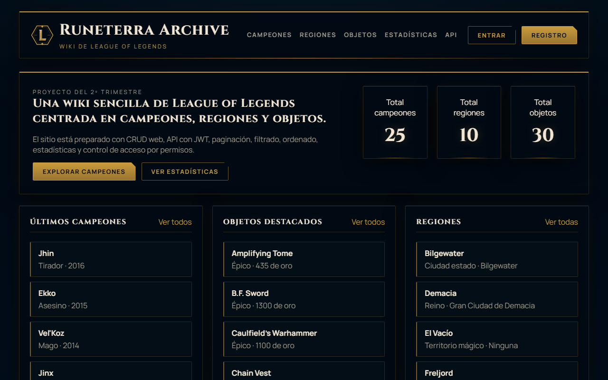
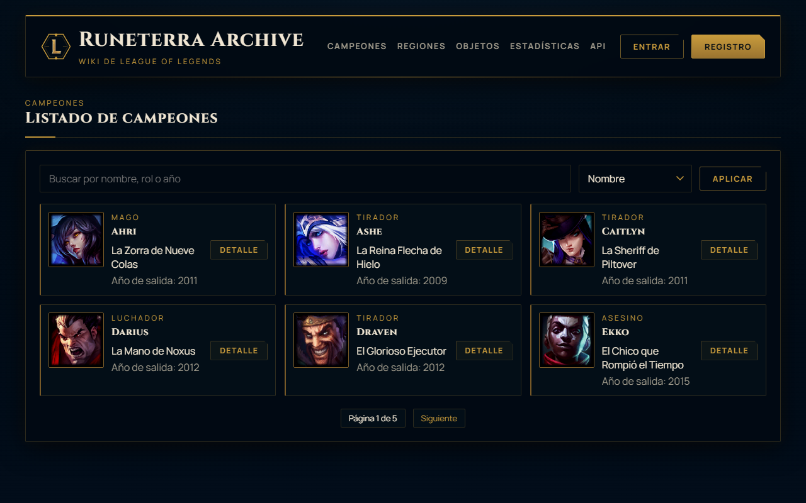
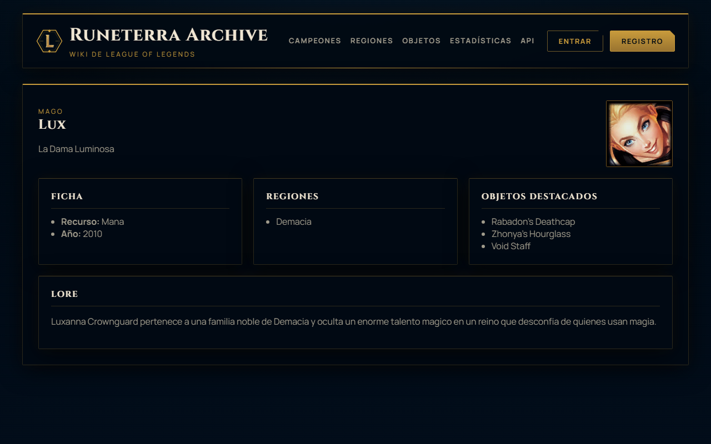
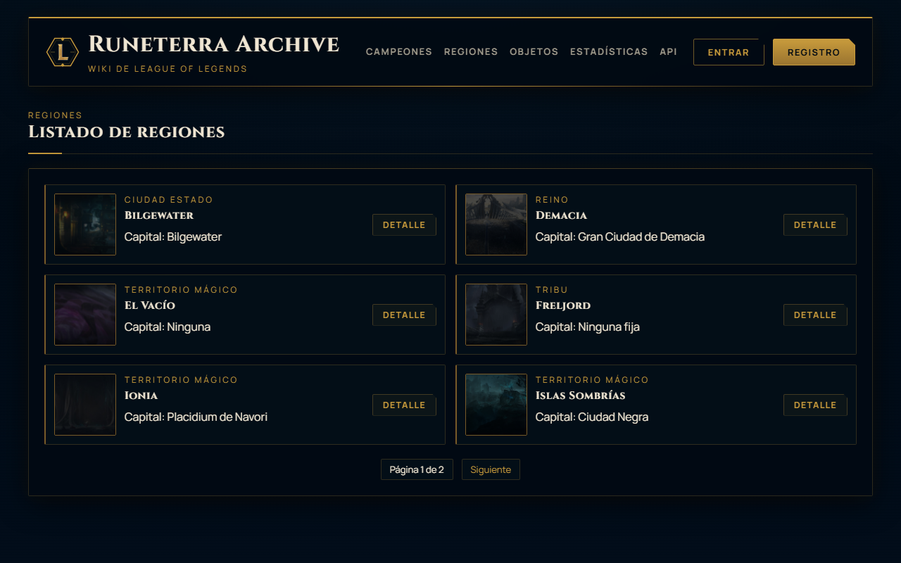
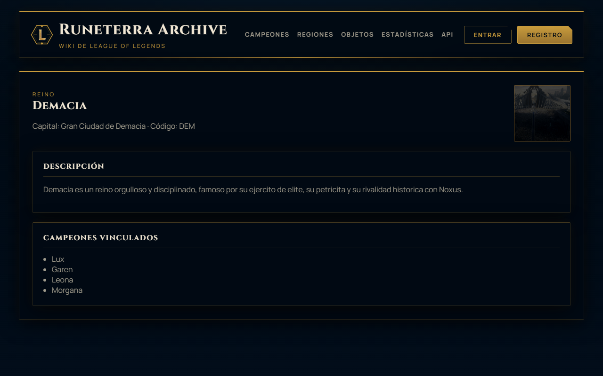
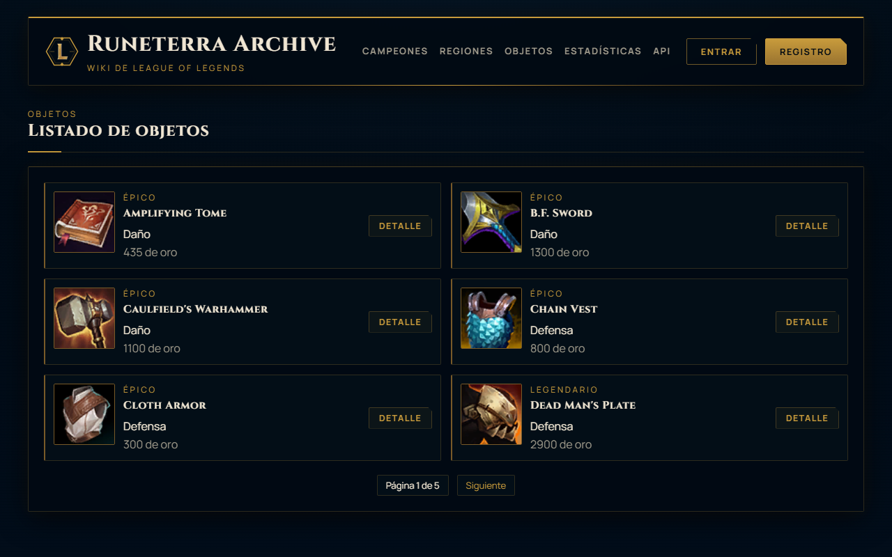
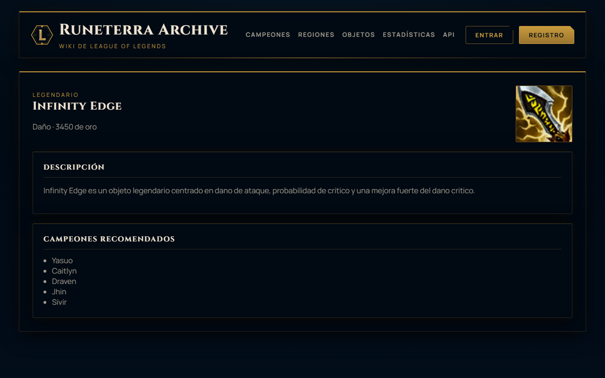
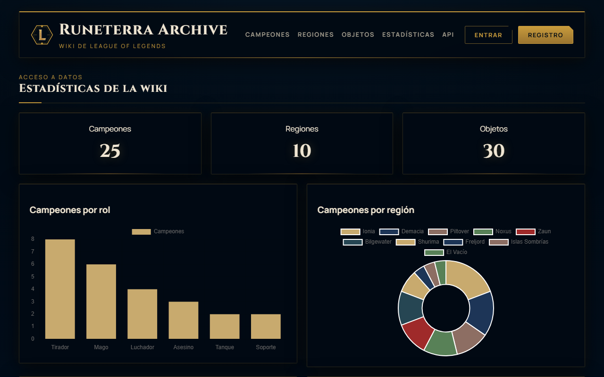

# Runeterra Archive

> **Proyecto educativo** — Wiki no oficial del universo de League of Legends construida con Django.



---

## Descripción

Runeterra Archive es una wiki interactiva del lore de League of Legends que permite explorar campeones, regiones y objetos del juego. El proyecto fue desarrollado con fines **exclusivamente educativos**, como práctica de desarrollo web full-stack con Python y Django.

---

## Capturas de pantalla

| Campeones | Detalle de campeón |
|---|---|
|  |  |

| Regiones | Detalle de región |
|---|---|
|  |  |

| Objetos | Detalle de objeto |
|---|---|
|  |  |

| Estadísticas |
|---|
|  |

---

## Stack tecnológico

| Capa | Tecnología |
|---|---|
| **Backend** | Python 3.12 · Django 5 |
| **Base de datos** | SQLite 3 |
| **API REST** | Django REST Framework |
| **Frontend** | HTML5 · CSS3 (custom, sin frameworks) |
| **Fuentes** | Cinzel · Manrope (Google Fonts) |
| **Assets** | CommunityDragon CDN |
| **Control de versiones** | Git |

---

## Funcionalidades

- **Campeones** — listado con búsqueda y filtro por rol, detalle con estadísticas y objetos destacados, imágenes oficiales.
- **Regiones** — listado con arte oficial de Clash, detalle con información de facción y capital.
- **Objetos** — catálogo de 30 objetos con iconos, clasificados por tier (Inicial / Épico / Legendario / Mítico).
- **Estadísticas** — gráficas de distribución de campeones por rol y dificultad.
- **API REST** — endpoints JSON para campeones, regiones y objetos.
- **Autenticación** — registro, inicio de sesión y cierre de sesión.
- **Panel de administración** — CRUD completo vía Django Admin y formularios propios.
- **Paginación** — todas las listas paginadas a 6 elementos por página.

---

## Instalación local

```bash
# 1. Clonar el repositorio
git clone https://github.com/tu-usuario/wiki-league-of-legends.git
cd wiki-league-of-legends

# 2. Crear y activar el entorno virtual
python -m venv .venv
# Windows
.venv\Scripts\activate
# macOS / Linux
source .venv/bin/activate

# 3. Instalar dependencias
pip install -r requirements.txt

# 4. Aplicar migraciones
python manage.py migrate

# 5. (Opcional) Seed de datos de ejemplo
python manage.py seed_champions
python manage.py seed_items
python manage.py seed_regions

# 6. Arrancar el servidor
python manage.py runserver
```

Abre [http://localhost:8000](http://localhost:8000) en tu navegador.

---

## Estructura del proyecto

```
wiki-league-of-legends/
├── lolwiki_project/        # Configuración Django
│   ├── settings.py
│   └── urls.py
├── wiki/                   # App principal
│   ├── models.py           # Champion, Region, Item
│   ├── views.py            # Vistas basadas en clases y funciones
│   ├── serializers.py      # DRF serializers
│   ├── templates/wiki/     # Plantillas HTML
│   └── management/         # Comandos de seed
├── static/wiki/            # CSS, iconos, imágenes
│   ├── styles.css
│   ├── champions/          # 25 iconos de campeones
│   ├── regions/            # 10 fondos de regiones
│   └── items/              # 30 iconos de objetos
└── docs/screenshots/       # Capturas de pantalla
```

---

## Aviso legal

Este proyecto es **no oficial** y tiene únicamente finalidad educativa. League of Legends, todos los campeones, nombres, imágenes y assets relacionados son propiedad de **Riot Games**. El uso de estos recursos se realiza al amparo de la [Política de uso de activos de Riot Games](https://www.riotgames.com/en/legal).

---

## Licencia

```
MIT License

Copyright (c) 2026

Permission is hereby granted, free of charge, to any person obtaining a copy
of this software and associated documentation files (the "Software"), to deal
in the Software without restriction, including without limitation the rights
to use, copy, modify, merge, publish, distribute, sublicense, and/or sell
copies of the Software, and to permit persons to whom the Software is
furnished to do so, subject to the following conditions:

The above copyright notice and this permission notice shall be included in all
copies or substantial portions of the Software.

THE SOFTWARE IS PROVIDED "AS IS", WITHOUT WARRANTY OF ANY KIND, EXPRESS OR
IMPLIED, INCLUDING BUT NOT LIMITED TO THE WARRANTIES OF MERCHANTABILITY,
FITNESS FOR A PARTICULAR PURPOSE AND NONINFRINGEMENT.
```
